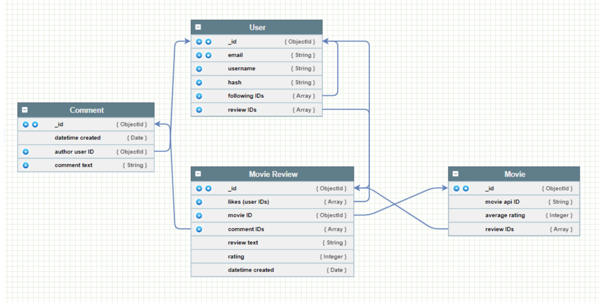
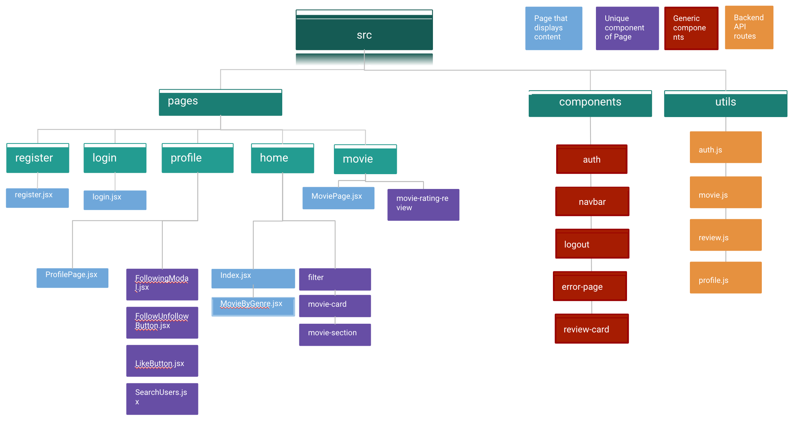

# Good Films

## Introduction

Good Films is a social app that allows users to search for movies and reviews. Users can sign up and review movies that they’ve watched. Reviews are editable and deletable. Think Goodreads but for movies!

Additionally, users are also able to ‘follow’ other users (instagram-esque style) whereby reviews of followees will be shown on the followers’ user feed. Users can also like and comment on these reviews.

Check us out at [Good Films](https://marcusmo117.github.io/good_films_react/#/movies).

## Links to Repos

- [React Frontend ](https://github.com/marcusmo117/good_films_react)
- [Express Backend ](https://github.com/lekpeng/good_films_express)

## Technologies

- MERN stack
- APIs from [The Movie Database](https://www.themoviedb.org/documentation/api), [DiceBear Avatars](https://avatars.dicebear.com/) and [Genderize](https://genderize.io/).
- Github Pages for frontend React deployment
- Cyclic for backend Express deployment

## Packages used

- Handle browser request: Axios, Cors,
- Authorisation: Bcrypt, Express-joi-validation, Jsonwebtoken
- Format commit messages: [Commitizen](https://www.npmjs.com/package/commitizen)
- Autocomplete in search bar: [React Bootstrap Typeahead](https://www.npmjs.com/package/react-bootstrap-typeahead)
- Style: React Bootstrap, Material UI

## Planned Model Schema

## Routes

| Page           | Front End URL               | Methods                 |
| -------------- | --------------------------- | ----------------------- |
| Register       | /register                   | New                     |
| Login          | /register                   | New                     |
| Home/User Feed | /                           | Get                     |
| Movies         | /movies                     | Get                     |
|                | /movies/:genreName/:genreId | Get                     |
|                | /movies/:movieId            | Get, Show, Post         |
| Reviews        | /reviews/:reviewId          | Get, Show               |
|                | /reviews/:reviewId/edit     | Get, Show, Edit, Delete |
| Profiles       | /profile/:userId            | Get, Show, Put, Delete  |

## Folder Structure

## Workflow

- Trello to keep track of individual tasks and share documents (schemas, routes, wireframe, etc..)
- Slack for day to day communications
- Development
  - Each member will pull from master branch from github into local and start working on a feature branch in local
  - Test for functionality and bugs on local
  - Once feature is done on local, to push to feature branch on github and merge with master branch on github
  - Test for functionality and bugs on ‘prod’ after every deployment

## Future Ideas

- [ ] Chat function between followers (friends)
- [ ] Login via Google/ FB
- [ ] Refreshing of user token
- [ ] Recommendations page based on users’ past reviewed movies
